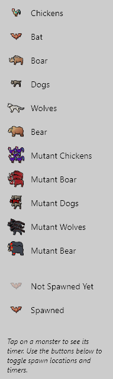

# Eternal Return Spawn Points Map

This project is a **React Native application** designed to help players of the game *Eternal Return* track spawn points of monsters and other entities on the game map. It includes features like **zoomable and pannable maps**, **day/night cycle timers**, and **interactive spawn location markers**. The app also provides a **legend panel** to explain the icons and spawn states.

## Features

- **Interactive Map**:
  - Zoom in and out for better visibility.
  - Pan around the map to explore different areas.

- **Spawn Location Tracking**:
  - Displays spawn points for monsters and other entities.
  - Translucent icons indicate monsters that have not yet spawned, while fully visible icons indicate spawned monsters.

- **Day/Night Cycle Timer**:
  - Tracks the current day/night cycle in the game.
  - Displays the remaining time for the current cycle.

- **Legend Panel**:
  - Explains the meaning of each icon on the map.
  - Includes examples of translucent (not spawned) and fully visible (spawned) icons.

- **Toggle Controls**:
  - Toggle the visibility of spawn locations and timers.
  - Collapsible legend panel to save screen space.

## How to Use

1. **Zoom and Pan**:
   - Use the **Zoom In** and **Zoom Out** buttons to adjust the map scale.
   - Drag the map to pan around and explore different areas.

2. **Spawn Locations**:
   - Spawn points are marked with icons on the map.
   - Translucent icons indicate monsters that have not yet spawned.
   - Fully visible icons indicate monsters that have already spawned.

3. **Day/Night Cycle**:
   - The current cycle (day or night) is displayed in the top-right corner.
   - The timer shows the remaining time for the current cycle.

4. **Legend Panel**:
   - Tap the **Show Legend** button to open the legend panel.
   - The panel explains the icons and provides examples of spawn states.
   - Tap **Hide Legend** to collapse the panel.

5. **Toggle Spawn Locations and Timers**:
   - Use the **Toggle Spawn Locations** button to show or hide spawn points.
   - Use the **Toggle Timers** button to show or hide timers for spawn points.

## Installation

1. Clone the repository:
   ```bash
   git clone https://github.com/Tech-Priest1/ERBSMap.git
   ```

2. Navigate to the project directory:
   ```bash
   cd eERBSMap
   ```

3. Install dependencies:
   ```bash
   npm install
   ```

4. Run the project:
   ```bash
   npx expo start --web  
   ```

5. Open the app on your device or emulator.

## Dependencies

- React Native
- React Native Animated
- React Native PanResponder
- React Native ImageBackground

## Screenshots

  
*Interactive map with spawn points and day/night cycle timer.*

  
*Legend panel explaining icons and spawn states.*

## Contributing

Contributions are welcome! If you'd like to contribute, please follow these steps:

1. Fork the repository.
2. Create a new branch for your feature or bugfix.
3. Commit your changes.
4. Submit a pull request.

## License

This project is licensed under the MIT License. See the [LICENSE](LICENSE) file for details.

